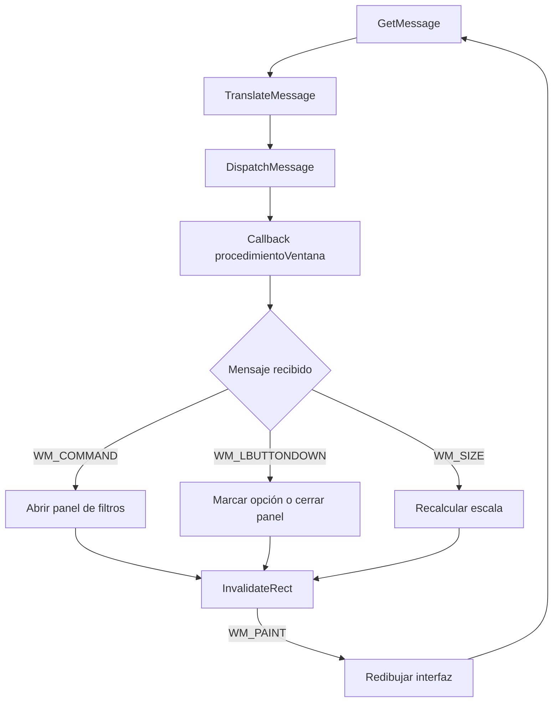

# Prototipo de mejora de interfaz — Portal de Empleos UBP

Prototipo académico desarrollado en C++ y Win32 para demostrar una mejora de
usabilidad basada en eventos. La propuesta incorpora un acceso visible a un
panel de filtros dentro de una maqueta de portal de empleos.

El trabajo corresponde al ejercicio **“Análisis y Mejora de la Interfaz de
Usuario en Software utilizando C++”** de la materia Programación Genérica y
Eventos.

## Objetivo

El objetivo es mostrar cómo una interfaz puede responder dinámicamente a las
acciones del usuario mediante:

- callbacks;
- un bucle despachador de eventos;
- eventos Paint;
- funciones de conversión.

La consigna permite construir un prototipo acotado: no es necesario implementar
un sistema completo, pero la interacción elegida debe funcionar y hacer visible
la mejora propuesta.

## Problema de usabilidad analizado

En un portal con múltiples ofertas laborales, encontrar resultados adecuados
puede requerir revisar demasiadas publicaciones. Si los criterios de búsqueda no
tienen un acceso claro y organizado, el usuario tarda más en descubrir cómo
refinar los resultados.

El prototipo toma ese escenario como punto de partida y se concentra en mejorar
el acceso a los filtros:

- presenta un botón **FILTROS** destacado y reconocible;
- agrupa las opciones por área, modalidad, tipo de empleo y orden;
- permite marcar y desmarcar opciones;
- ofrece varias formas de cerrar el panel: la cruz, el botón Cerrar o un clic
  fuera de la ventana emergente;
- repinta inmediatamente la interfaz después de cada interacción.

## Alcance del prototipo

La funcionalidad demostrada es la apertura, interacción y actualización visual
del panel de filtros. Las opciones seleccionadas conservan su estado mientras el
programa está abierto, pero todavía no modifican las ofertas mostradas ni se
conectan con una base de datos.

Esta limitación es intencional: el propósito es evidenciar el manejo de eventos
y el repintado dinámico, no desarrollar un portal de empleos completo.

## Conceptos solicitados por la consigna

| Concepto | Implementación en el proyecto |
|---|---|
| **Callback** | `procedimientoVentana` es registrado como `lpfnWndProc`. Win32 lo invoca cuando ocurre un evento y la función delega el mensaje en la instancia de `Aplicacion`. |
| **Bucle despachador** | `GetMessage`, `TranslateMessage` y `DispatchMessage` mantienen la aplicación activa y envían cada mensaje al callback. |
| **Eventos Paint** | `WM_PAINT` redibuja la ventana mediante `BeginPaint`/`EndPaint`; `WM_DRAWITEM` permite personalizar el botón de filtros. |
| **Funciones de conversión** | Las coordenadas reales del mouse se convierten al sistema fijo de la maqueta. También se convierten dimensiones, posiciones y colores al formato utilizado por Win32. |

Los cuatro puntos están señalados llamativamente en
[`Aplicacion.h`](Aplicacion.h) con comentarios `PUNTO DE LA CONSIGNA`.

## Flujo principal de eventos



## Características

- Interfaz gráfica nativa para Windows mediante Win32 y GDI.
- Botón de filtros personalizado con ícono, sombra y estados visuales.
- Ventana emergente con cuatro grupos de opciones.
- Selección visual de filtros mediante clics.
- Diseño escalable que conserva la proporción de la maqueta.
- Componentes visuales reutilizables para textos, rectángulos, etiquetas y
  tarjetas de ofertas.
- Navegación básica por teclado para enfocar y activar el botón de filtros.

## Estructura principal

```text
.
├── main.cpp             # Puntos de entrada de la aplicación
├── Aplicacion.h         # Ventana, callback, mensajes, Paint y conversiones
├── Componentes.h        # Página, buscador, ofertas y botón de filtros
├── Filtros.h            # Estado, interacción y dibujo del panel de filtros
├── Graficos.h           # Abstracciones de dibujo, fuentes, colores y escalado
├── Constantes.h         # Dimensiones base e identificadores de Win32
├── Ejercicio Parcial.slnx
└── Ejercicio Parcial.vcxproj
```

Los archivos `Conversion.*`, `ModelosInterfaz.h` y `RenderizadorConsola.*`
pertenecen a una versión anterior del prototipo basada en consola y no forman
parte de la compilación gráfica actual.

## Requisitos

- Windows 10 o posterior.
- Visual Studio con la carga de trabajo **Desarrollo para el escritorio con
  C++**.
- Windows SDK 10.
- Compilador compatible con C++20.

## Compilación y ejecución

1. Clonar o descargar el repositorio.
2. Abrir `Ejercicio Parcial.slnx` en Visual Studio.
3. Seleccionar una configuración, por ejemplo `Release | x64`.
4. Compilar con **Compilar → Compilar solución**.
5. Ejecutar con `Ctrl + F5`.

También puede abrirse directamente `Ejercicio Parcial.vcxproj` si la versión de
Visual Studio no reconoce el formato `.slnx`.

## Uso

1. Ejecutar la aplicación.
2. Presionar el botón rojo **FILTROS**.
3. Marcar o desmarcar las opciones deseadas.
4. Cerrar el panel mediante la cruz, el botón **Cerrar** o haciendo clic fuera
   de él.

## Relación con los criterios de evaluación

- **Identificación del problema:** se analiza la dificultad para descubrir y
  organizar criterios de búsqueda en un listado de empleos.
- **Innovación y efectividad:** el acceso destacado y el panel agrupado hacen
  visible la interacción propuesta.
- **Calidad del prototipo:** la solución utiliza componentes reutilizables,
  estado separado, escalado y eventos nativos de Windows.
- **Claridad de la documentación:** el código contiene comentarios específicos
  que identifican cada concepto técnico solicitado.

## Documentación para la entrega académica

Este README resume el proyecto, pero la consigna también solicita un informe en
PDF. Para la entrega final se recomienda incluir:

1. descripción del software y del problema de usabilidad;
2. justificación de la solución propuesta;
3. explicación de los cuatro conceptos técnicos;
4. una captura de la pantalla principal;
5. una captura del panel de filtros abierto;
6. una captura con varias opciones seleccionadas.

## Estado

El prototipo gráfico compila y permite abrir, utilizar y cerrar el panel de
filtros. La aplicación efectiva de los filtros sobre las ofertas queda fuera del
alcance definido para esta demostración.
